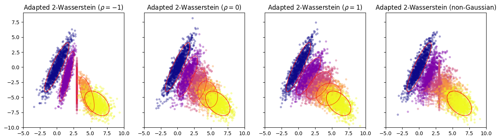
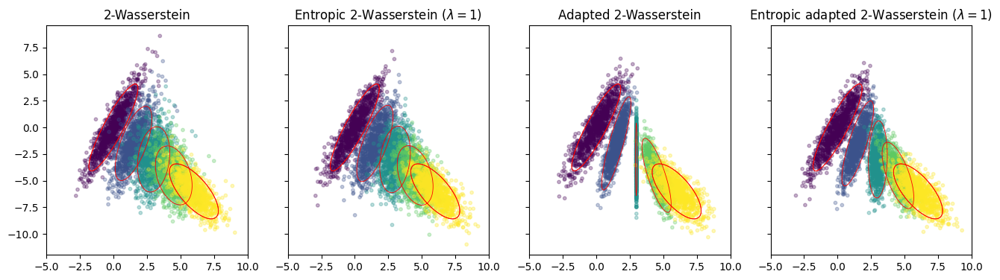

# Entropic Adapted Wasserstein 2 distance on Gaussians 

Illustrative implementation of Entropic Adapted 2-Wasserstein between Gaussian Processes.

## Setup
```bash
$ git clone
$ python -m venv .venv
$ source .venv/bin/activate
$ python -m pip install -r requirements.txt
```
## Notebook

Different $\mathcal{AW}_2$-optimizers: the optimizers may not be unique, not be gaussian, and not be Monge-type
   

   
Comapre $\mathcal{W}_2$-optimizer, $\mathcal{AW}_2$-optimizer, entropic $\mathcal{W}_2$-optimizer, and entropic $\mathcal{AW}_2$-optimizer
   


See details in the Jupyter notebook.


## Reference
- [Entropic Adapted Wasserstein on Gaussians](https://arxiv.org/abs/2412.18794)  

